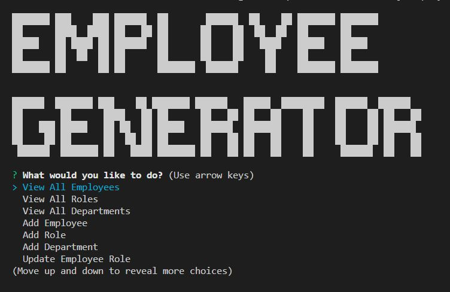

# Employee Tracker 

## Description:

&nbsp; Introducing our newest command-line application that will revolutionize the way you manage your employees! With just a few simple commands, you can view all your departments, roles, and employees, add new ones to the database, and update an employee's role in seconds.

Gone are the days of sifting through endless spreadsheets and files just to find the information you need. Our application presents everything in a clear and concise manner, with formatted tables that make it easy to read and understand.

Adding new departments, roles, and employees has never been easier. Simply input the relevant information when prompted and the application will automatically update your database. And when it comes time to update an employee's role, just select the employee and enter their new role. It's that easy!

With our application, you'll have everything you need to manage your employees at your fingertips. Say goodbye to the hassle of managing employee information and say hello to a more efficient and streamlined process. Don't miss out on this opportunity to take your employee management to the next level!

## User Story

AS A business owner
I WANT to be able to view and manage the departments, roles, and employees in my company
SO THAT I can organize and plan my business

## Table of Contents:

- [Installation](#installation)
- [Usage](#usage)
- [Tests](#tests)
- [Badges](#badges)
- [How_to_Contribute](#how_to_contribute)
- [Questions](#questions)
- [License](#license)

## Installation:

1. Start by opening a terminal or command prompt and navigating to the directory where the code is located.<br>
2. Run 'npm i' install to install the required packages.<br>

```
npm i
```

3. Enter the command below to be prompted for a password to log in to the MySQL server. Password to login in is 'password123.'

```
mysql -u root -p
```

4. Run the following commands to create the database and seed with values.

```
source db/schema.sql
source db/seeds.sql
```

## Usage:

&nbsp; The website can be found at: https://github.com/arishorts/SQL-Employee-Tracker
&nbsp; A video demonstration can be seen at: https://youtu.be/Pgshoafgazk



### Operation

This code is a command-line interface (CLI) for managing employee information stored in a MySQL database. To use it, you need to have MySQL installed on your computer and have access to a MySQL server.<br>

1. After the packages are installed, run the command node index.js to start the app.<br>
2. The CLI will prompt you with a list of options for viewing and adding employee information. Follow the prompts to select the desired option and enter the necessary information.<br>
3. To exit the CLI, select the "Exit" option from the main menu or press Ctrl+C in the terminal/command prompt.<br>

## Tests:

&nbsp; N/A

## Badges:


## How_to_Contribute:

&nbsp; If you would like to contribute, refer to the [Contributor Covenant](https://www.contributor-covenant.org/)

## Questions:

&nbsp; My GitHub profile can be found at: https://github.com/arishorts
<br>&nbsp; Reach me with additional questions at : arieljschwartz@gmail.com

## License:

&nbsp; http://choosealicense.com/licenses/mit/

---

© 2022 Ariel Schwartz LLC. Confidential and Proprietary. All Rights Reserved.

```

```
